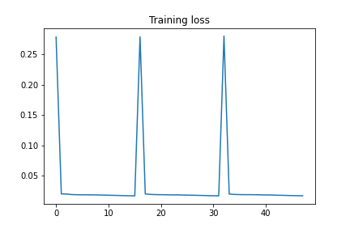
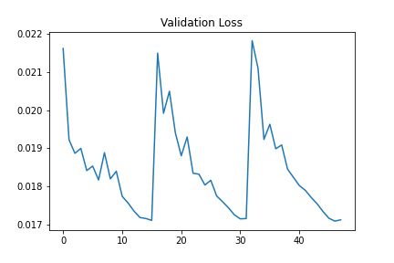
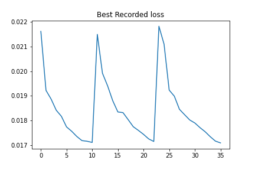

# Kagle_Mechanism_of_Action

This is a Kagle challenge. The details of the challenge can be found [here](https://www.kaggle.com/c/lish-moa/overview).

## What the programme does:

Predicting multiple targets of the Mechanism of Action (MoA) response(s) of different samples (sig_id), given various inputs such as gene expression data and cell viability data.

Some of the important terms used in the headings of the tables are presented here:
    
	    g - : signifies gene expression data
	    c - : signifies cell expression data
	    cp_type : indicates samples treated with a compound (cp_vehicle) or with a control perturbation (ctrl_vehicle)
	    NOTE: (samples with control perturbations don't have MoAs)
	    cp_time - treatment duration (24,48,72) Hours
	    cp_dose - Dosage - HIGH or LOW

## Author

Govind Ajith Kumar 

## Directory Structure

		 Directory_containing_all_codes
		 DIRECTORY:CSV_FILES
				    |___<all_csv_data_files>
		 Main_Notebook

## Pre-requisites

Please ensure that you have the following libraries pre-installed.

 - pytorch
 - seaborn
 - numpy
 - sklearn
 - matplotlib
 - pandas

## Requirements

 - While the programme can run on CPU, its much faster on GPU. Hence, please have your GPU/CUDA enabled.
 - Python 3.x

# Learning curves

## Iteration_1

  

  

  

## Work inspired by

The programme worked on is inspired by [this](https://www.kaggle.com/utkukubilay/pytorch-moa-0-01867).

